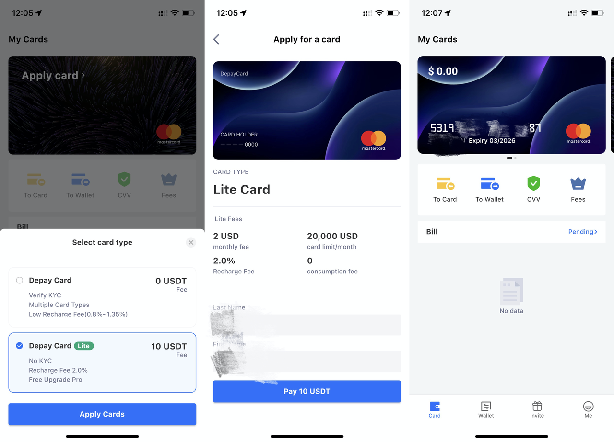
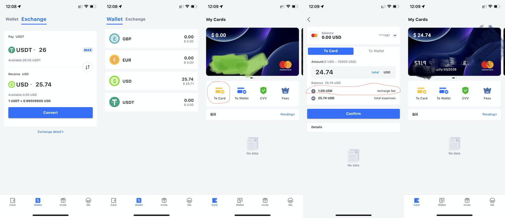
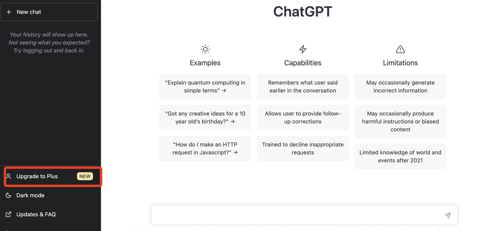
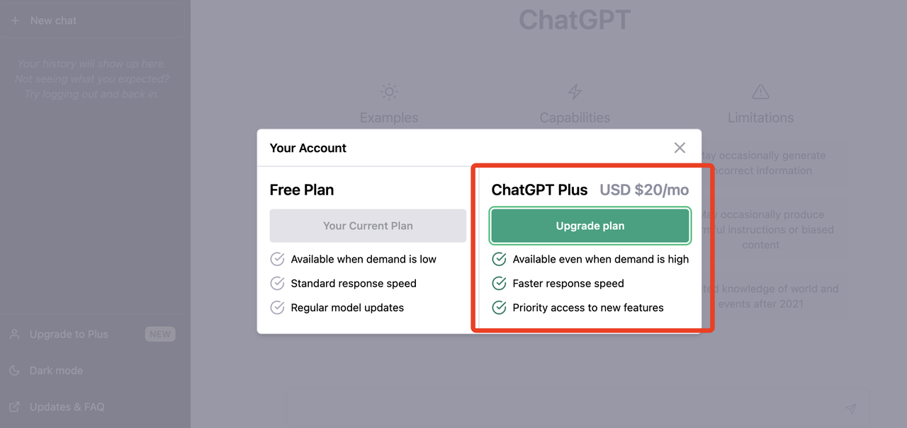
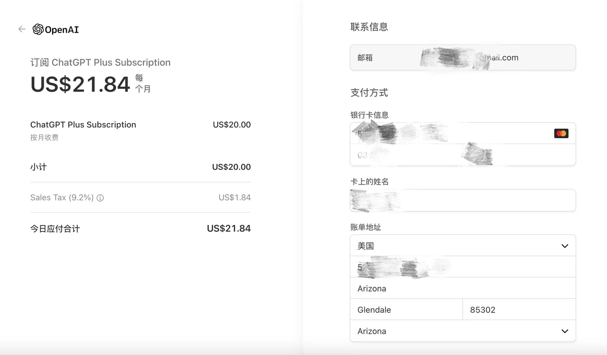
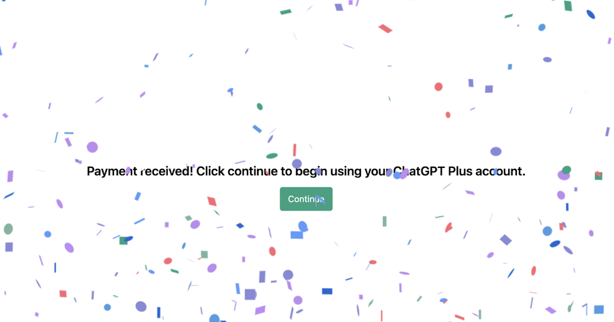
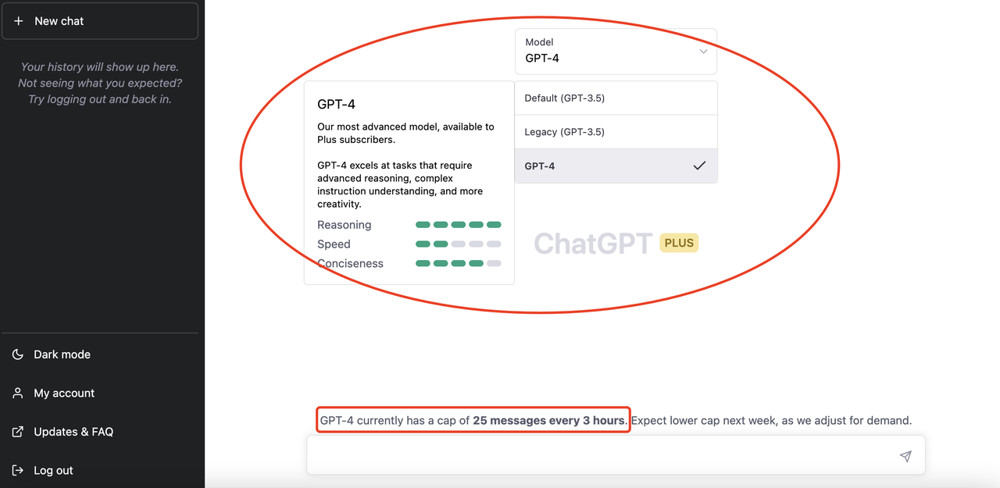
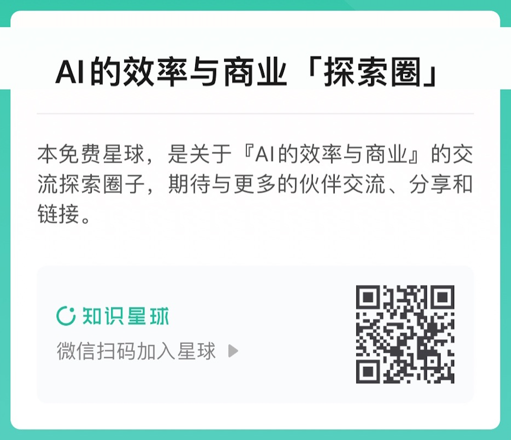

## 升级ChatGPT Plus（官方推荐）

`🚀 文末有惊喜🍺  `

 
`快速跳转到「ChatGPT注册页」： ` [https://gpt-plus.github.io/chatgpt/ToChatGPT.html](https://gpt-plus.github.io/chatgpt/ToChatGPT.html)

 
### 前提条件

>a. 有ChatGPT账号，体验过免费版。如果没有，请按“[Easy注册ChatGPT账号](https://gpt-plus.github.io/chatgpt/ToChatGPT.html)”文档先申请账号。实在找不到梯子的，推荐一个性价比高的DuangCloud，点击链接：[https://portal.dc-site5.com/#/register?code=4UF1Ymbn](https://portal.dc-site5.com/#/register?code=4UF1Ymbn)，2分钟完成注册。
>
> b. “ChatGPT账号 + 梯子”是必备条件。

 
## 【一】新升级流程（简单）

> 1、如果你是iPhone手机用户，注册美区AppleID，注意注册时填无支付方式（具体可看视频: https://www.youtube.com/watch?app=desktop&v=L3TpmMwSp84）。
>
> 2、用美区AppleID登录App Store，会提示你验证账单信息，填地址生成器（本文档有提供）生成的美国地址即可（建议用免税州），然后下载ChatGPT APP。
>
> 3、给美区AppleID用礼品卡充值，会用到支付宝，具体可以百度，有详细的操作方法。
>
> 4、充值到账后，登录ChatGPT直接升级Plus，会直接用AppleID余额扣款。

 
## 【二】旧升级流程（多用途）

 
### 流程

+ 注意：国内Visa卡无法完成ChatGPT扣款，建议用虚拟信用卡Dupay

+ 流程：
`(准备好数字货币USDT) > (申请Dupay信用卡) > (充值USDT, 兑换USD充值, 到Dupay账户) > (付款购买ChatGPT Plus会员)`

 
### 第一步：准备好“数字货币USDT”(简称U)

**1、注册自己的数字货币交易所账户**
> 注意：新用户注册并完成KYC，充币到账后需要24小时后才可以提币

经过FTX事件，建议选择大的交易所，推荐两家：币安和欧易（认准官网链接）

 
**欧易交易所：**
> 使用手机浏览器访问 [https://cnouyi.care/join/4dMW-2320060](https://cnouyi.care/join/4dMW-2320060) 下载并注册欧易。

**币安交易所：**
> 使用手机浏览器访问 [https://www.binance.com/zh-CN/activity/referral-entry/MYB23J?fromActivityPage=true&ref=LIMIT_TJMCEZWS](https://www.binance.com/zh-CN/activity/referral-entry/MYB23J?fromActivityPage=true&ref=LIMIT_TJMCEZWS)

注册成功后，通过C2C买U即可。

 
**2、找靠谱的代充服务**
注册交易所账户和转账的过程会有些门槛，如果嫌麻烦可以找代充服务，让别人把U打到你的Dupay钱包USDT地址，至于怎么找，自己想办法。

 
### 第二步：申请Dupay虚拟信用卡&兑换充值

> 【特别提示：Dupay卡每个月的管理费为2刀】

**1、快速注册**

> 安全性：Dupay持有美国MSB牌照，并接受Fincen(金融犯罪执法局)的合规监管。Dupay采用了多重签名冷钱包技术，资产受到离线保护。

+ 注册Dupay：
[https://dupay.one/web-app/register-h5?invitCode=107919&lang=zh-cn](https://dupay.one/web-app/register-h5?invitCode=107919&lang=zh-cn) 

+ 用途说明：
	+ ❶ 升级Plus扣款。
	+ ❷ 绑定非大陆AppleID用美刀消费。
	+ ❸ 支持绑定支付宝、微信支付、美团外卖、拼多多、Paypal(国区、美区、港区)、天猫国际版等。
	+ ❹ 支持Stripe商户、Google Play商店、YouTube Premium、Paypal商户、美区苹果商店、和支持非3DS卡的电商网站。

+ 推荐指数：⭐️⭐️⭐️⭐️⭐️⭐️。

 
**2、下载APP**
+ 安卓端：直接从Google Play商店下载 
	+ 

 
+ 苹果端：
	+ 国内Apple ID，需要通过TestFlight来安装Dupay APP。

	+ 非大陆的Apple ID，在App Store搜索“Dupay”。 

 
**3、向Dupay钱包的USDT地址充值**
+ 区块链网络选择，这里选择TRC20。从欧易交易所提币也选择TRC20网络，其中欧易交易所手续费1U，如图五36U 已经到Dupay账户中。

+ 另外，如果是找其它人代充的话，需要把下图四中的地址或者二维码给对方，确认好是自己的地址，再让对方充值。

 
**4、Dupay开卡、兑换USD和账户充值**
+ 开卡有两种方式，需要KYC的则开卡费，不需要KYC的需要10USDT。

 
+ USDT兑换USD时也是需要费用1USD。
+ 兑换后，直接充值到信用卡账户中（可以选择你想充多少钱进卡里，Plus是20USD/月） 

 

### 第三步：用Dupay购买ChatGPT Plus 会员

**1、在ChatGPT页面，点击“Upgrade to Plus”跳转到升级页**
+ 点击菜单

+ 订阅

 
**2、填写付款信息和地址**
+ 按Dupay信用卡信息填写，CVV码需要点击页面才显示（有朋友反馈随意填也可）
+ 美国地址用生成器[https://www.meiguodizhi.com](https://www.meiguodizhi.com) 或者 用uszcn.com 这类方式解决。
+ 梯子必须是全局代理（有朋友反馈用台湾代理也成功）
+ 如果出现卡被拒绝，尝试换代理节点，浏览器（建议Chrome）用隐私模式重新登录 ChatGPT再付款。 

 
**3、付款成功页面**
+ Plus 来了！

> 备注：笔者付款时用的是梯子全局代理模式，走台湾线路。

 
***总结：***
> 以非KYC方式开卡的总费用：
> 1U交易所提币费+10U开卡费+1U货币兑换费+0.3U兑换损耗+20U月费+1.84U税 = > > 34.14 U

 
### 第四步、体验GPT-4 
+ 开始体验Plus

 

## 附录：
 + 🔥 加入 “AI的效率与商业「探索圈」” 知识星球:
	+ `本免费星球，是关于『AI的效率与商业』的交流探索圈子，期待与更多的伙伴交流、分享和链接。  `
	+ `🚀 当前知识星球「限时免费」，邀请你加入。  `
	+ `--------------------------------  `
	