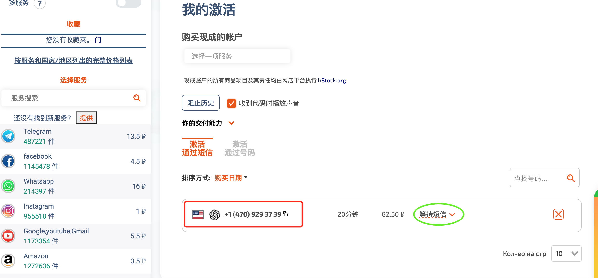
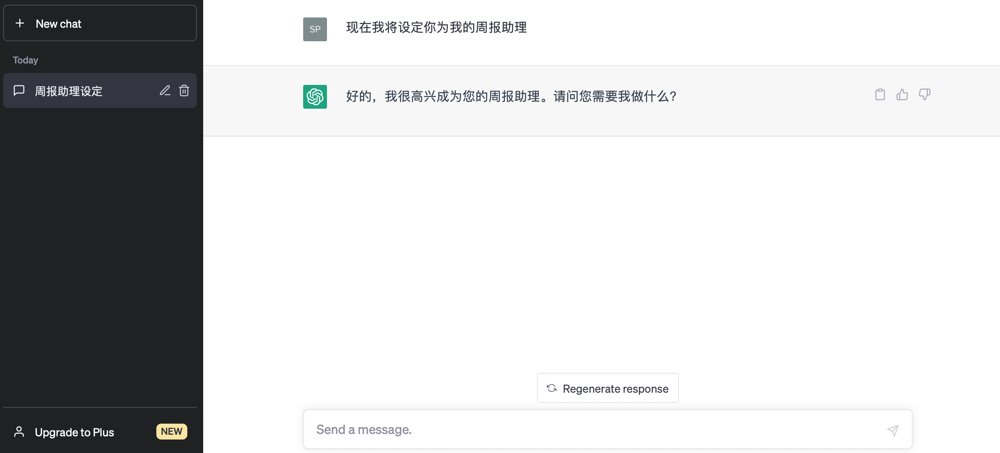

# Easy注册ChatGPT账号

 

>+ 推荐注册「国际虚拟信用卡Depay」：[https://depay.depay.one/web-app/register-h5?invitCode=107919&lang=zh-cn](https://depay.depay.one/web-app/register-h5?invitCode=107919&lang=zh-cn) 
>
>+ 安全性：Depay持有美国MSB牌照，并接受Fincen(金融犯罪执法局)的合规监管。Depay采用了多重签名冷钱包技术，资产受到离线保护。
>
>+ 用途说明：
	+ ❶ 升级Plus扣款。
	+ ❷ 绑定非大陆AppleID用美刀消费。
	+ ❸ 支持绑定支付宝、微信支付、美团外卖、拼多多、Paypal(国区、美区、港区)、天猫国际版等。
	+ ❹ 支持Stripe商户、Google Play商店、YouTube Premium、Paypal商户、美区苹果商店、和支持非3DS卡的电商网站。
>
>+ 推荐指数：⭐️⭐️⭐️⭐️⭐️⭐️

`快速跳转到「Plus升级页」： ` [https://gpt-plus.github.io/chatgpt-plus/ToPlus.html](https://gpt-plus.github.io/chatgpt-plus/ToPlus.html)

 
### 准备梯子(科学上网)
> 注意：如果自己已有梯子则略过。

+ 梯子推荐
    + 关于梯子有很多，推荐一个性价比高的DuangCloud。点击链接：[https://portal.dc-site5.com/#/register?code=4UF1Ymbn](https://portal.dc-site5.com/#/register?code=4UF1Ymbn)，2分钟完成注册。
    + 推荐原因：有专属的ChatGPT线路。

+ 套餐选择
    + 登录后如图，根据自己使用频率和流量选择一个套餐即可（推荐最便宜的，试用满意可再选价格高的套餐），再按照左边菜单中的“使用文档”操作即可。
    

 
### 第一步：注册邮箱(建议Google Gmail)

+ Gmail邮箱的注册
    + 登录梯子，点击以下链接注册：
[https://accounts.google.com/signup/v2/webcreateaccount?service=mail&continue=https%3A%2F%2Fmail.google.com&hl=zh-CN&biz=false&flowName=GlifWebSignIn&flowEntry=SignUp ](https://accounts.google.com/signup/v2/webcreateaccount?service=mail&continue=https%3A%2F%2Fmail.google.com&hl=zh-CN&biz=false&flowName=GlifWebSignIn&flowEntry=SignUp )

 
> 注意：
> + 有不少人反馈，Gmail注册手机验证有问题，（+86）手机号码都可以通过，不行的话就多切换到手机操作，PC的网络IP固定容易命中>Google账号风控。
> + 特别提示，微软Outlook或Hotmail目前都被OpenAI限制注册。

 
### 第二步：科学上网指向欧洲IP，注册OpenAI账号

+ 把梯子的线路指向美国、欧洲、日本、新加坡等IP（建议美国原生IP）
OpenAI官方注册链接：[https://chat.openai.com/auth/login?next=%2F](https://chat.openai.com/auth/login?next=%2F)

+ 关键的一步是国际短信验证码，建议选择美国地区。
	+ 一般，直接在验码平台处理[https://sms-activate.org/](https://sms-activate.org/)，费用1美元即可，但有小小的操作难度。
    + 通过搜索“OpenAI”，获取相关服务。
    
    + 下面是购买“美国区”的短信服务，可以复制号码到ChatGPT短信验证页，按发送后即可到“sms-activate”平台收取短信。
    

 
### 第三步：体验ChatGPT

+ 体验ChatGPT
	+ 科学上网，登录 [https://chat.openai.com/auth/login](https://chat.openai.com/auth/login) 即可
    

 
+ ChatGPT的版本与功能说明
	+ `GPT免费版： `
		+ 免费版默认的模型是基于text-davinci-002-render-sha架构训练的，这是GPT-3.5版本中的一个重要架构之一。该架构包含了许多改进和优化，可以提供更高的精度和更先进的功能。

	+ `GPT Plus版： `
        + `【Default（GPT-3.5）模型】： ` Default（GPT-3.5）是GPT-3系列中的一个升级版，优化了一些功能和性能。它的架构基于GPT-3，但具有更好的理解和生成文本的能力。这个模型适用于各种NLP任务，如问答、摘要、翻译、对话生成等。Default（GPT-3.5）在处理这些任务时可以提供更高质量的结果，同时具有较好的性能和可扩展性。

	    + `【Legacy（GPT-3.5）模型】： ` Legacy（GPT-3.5）是GPT-3系列的一个早期版本。虽然它在性能和功能上不如Default（GPT-3.5），但在某些应用场景和任务中，这个模型可能更适合一些用户的需求。例如，如果您需要一个资源占用较低的AI系统，Legacy（GPT-3.5）可能是一个合适的选择。然而，总体上，Legacy（GPT-3.5）的性能和功能可能不如Default（GPT-3.5）。

	    + `【GPT-4模型】： ` GPT-4是一个基于GPT-3架构的升级版本，具有更多的参数和更大的模型容量。这意味着GPT-4在理解、生成和推理方面的能力更强，可以处理更广泛和复杂的任务。与GPT-3.5相比，GPT-4在很多任务中表现更出色，例如问答、摘要、翻译、对话生成等。然而，由于GPT-4的模型规模更大，它可能需要更多的计算资源，这可能会影响到部署和维护的成本。
		

 
### 第四步：常见问题
+ 遇到“Not available, OpenAI‘s service are not available in your country”问题，则是IP问题，指向美国/欧洲/新加坡/日本等即可。
+ 经常需要人机确认，或者网络响应慢，这是正常的。
+ 在与ChatGPT对话过程中，弹出红色错误，也是正常的，刷新网页即可。

 
### 附录：
 + ChatGPT星球专栏:
	+ `10年前iPhone 4的发布掀起了移动互联网浪潮，而今天的ChatGPT则是大语言模型计算时代的iPhone 4时刻。  `
	+ `ChatGPT将颠覆现有的生产工具，我们都身处这场变局之中，在大部分人还在怀疑、看不懂、没醒过来的时候正是你的机会。  `
	+ `率先拥抱ChatGPT是普通人能够抓住的先发优势，理解这个变局时代，利用这个强大工具来打造你自己的生产要素。  `
	+ `领先他人一步，就在一念间，你要做的就是拿起ChatGPT这把屠龙刀，发挥它的优势、激活它的价值。 物竞天择，适者生存，变局时代，唯有主动自我进化。  `

+ 加入ChatGPT进化圈，一起进化思维和生产工具，构建可以赢得未来的生产模式；星球会阶梯式涨价，扫码了解，报名立享前期优惠价。
+ `添加星球运营微信：🚀 `

